# Engineering Design Document (EDD)
# Pictro iOS App Architecture Analysis

**Document Version:** 1.0
**Date:** 2025-01-28
**Authors:** AI Architecture Analysis Agent
**Status:** Complete

## Table of Contents
1. [Overview](#overview)
2. [Architecture](#architecture)
3. [UI ↔ Service Interaction](#ui--service-interaction)
4. [Data Contracts](#data-contracts)
5. [Observability](#observability)
6. [Tech Debt & Risks](#tech-debt--risks)
7. [Refactor Plan](#refactor-plan)
8. [Appendix](#appendix)

---

## 1. Overview

### 1.1 System Purpose
Pictro is an iOS photo management application that helps users organize, review, and curate their photo library through an intuitive swipe-based interface. The app focuses on efficient photo processing with month-based organization and smart deletion workflows.

### 1.2 High-Level Component Architecture

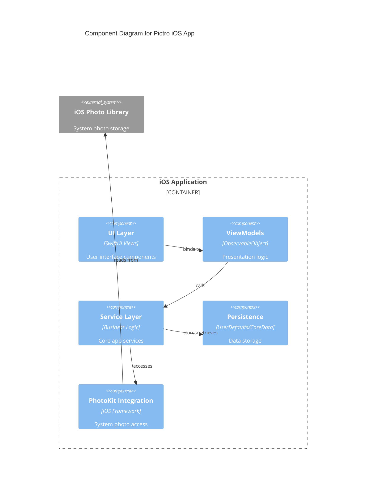

### 1.3 Key Features
- **Month-based Photo Organization**: Photos grouped by capture month
- **Swipe Review Interface**: Tinder-like card interface for photo curation
- **Smart Deletion Queue**: Batched deletion with review capabilities
- **Fullscreen Photo Viewing**: Immersive photo inspection with gesture controls
- **Progress Tracking**: Per-month completion statistics
- **Biometric Security**: Optional security for deletion operations

---

## 2. Architecture

### 2.1 Architectural Pattern: MVVM + Service Layer

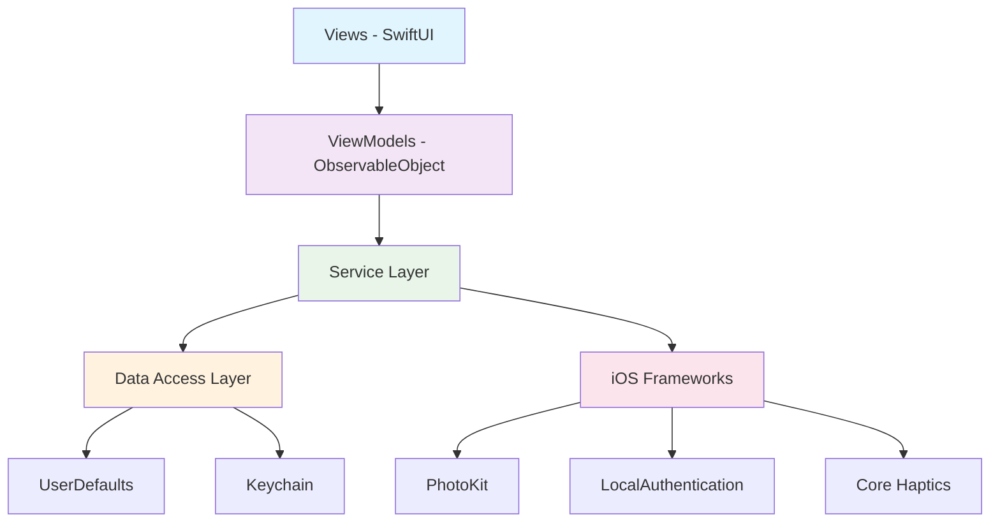

### 2.2 Layer Responsibilities

| Layer | Responsibility | Key Components |
|-------|---------------|----------------|
| **UI Layer** | User interaction, visual presentation | `MonthListView`, `SwipeReviewView`, `FullscreenCardView` |
| **ViewModel Layer** | Presentation logic, state management | `ReviewViewModel`, `MonthListViewModel` |
| **Service Layer** | Business logic, coordination | `PhotoLibraryService`, `PersistenceService`, `HapticsService` |
| **Data Layer** | Data persistence, external APIs | UserDefaults, PhotoKit integration |

### 2.3 Dependency Injection Strategy

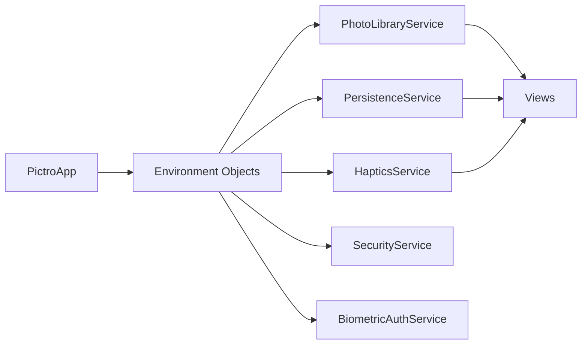

**Pattern**: Environment Object injection through SwiftUI's `@EnvironmentObject`
- **Pros**: Clean, declarative, SwiftUI-native
- **Cons**: Runtime dependency resolution

---

## 3. UI ↔ Service Interaction

### 3.1 Core User Journey: Photo Review Flow

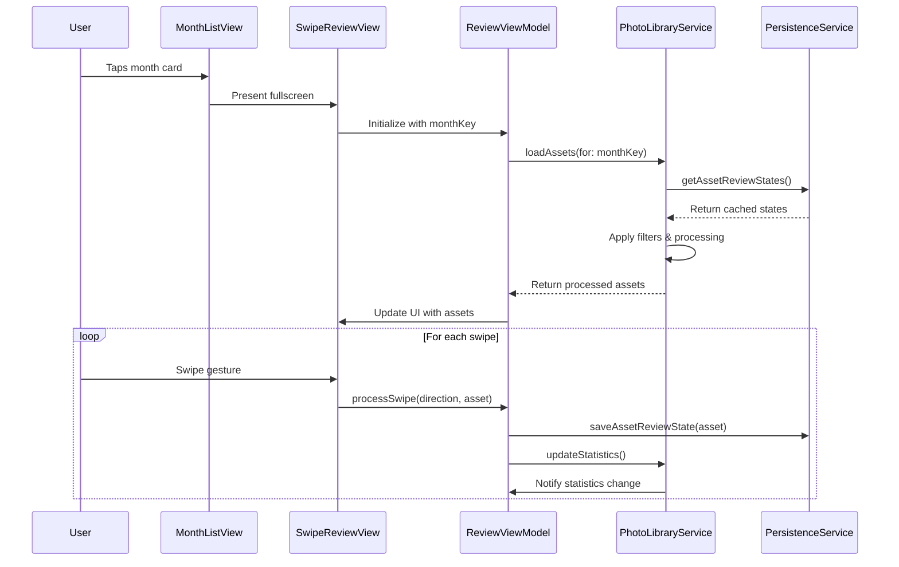

### 3.2 Fullscreen Photo Viewing Flow

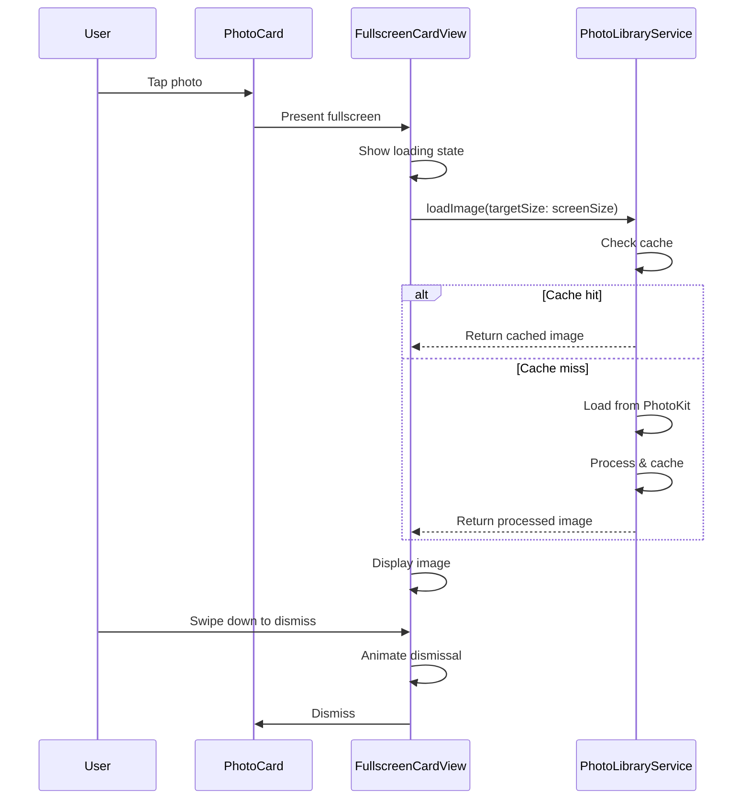

### 3.3 Data Flow Architecture

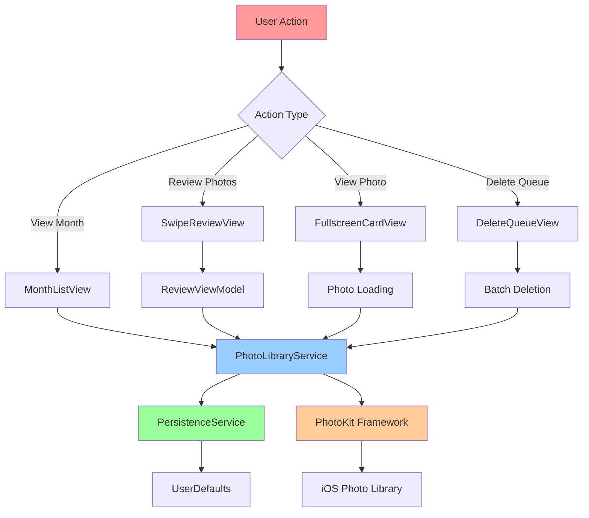

---

## 4. Data Contracts

### 4.1 Core Data Models

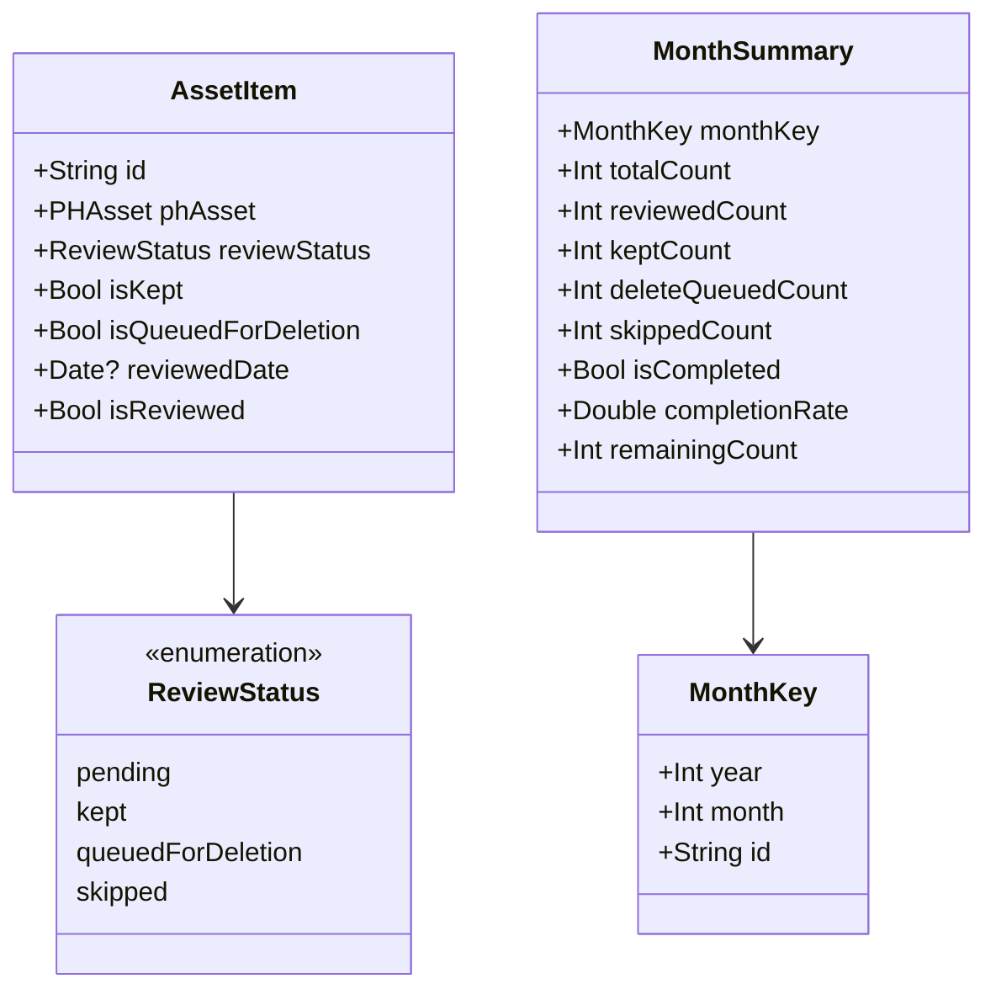

### 4.2 Service Interfaces

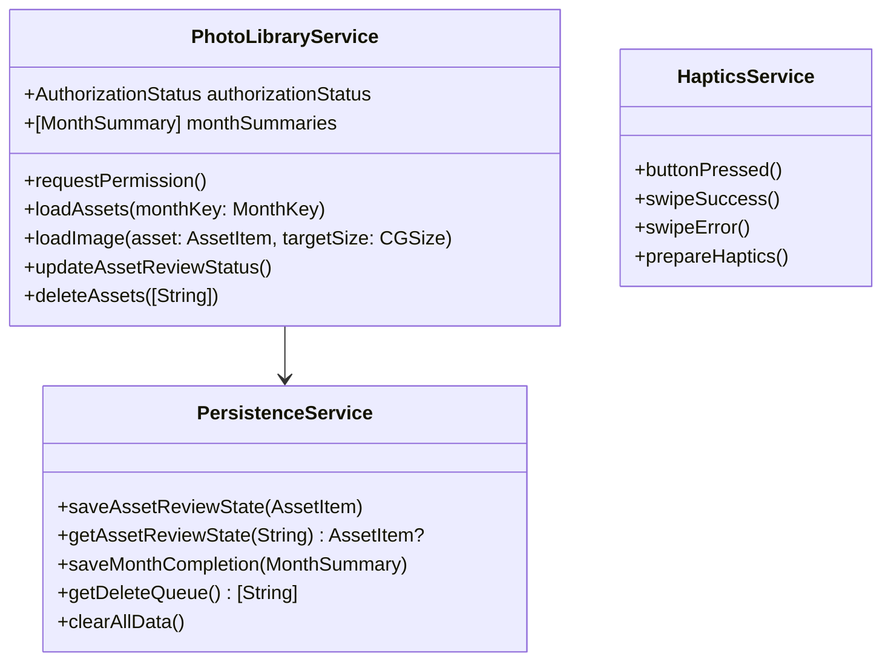

### 4.3 Error Handling Strategy

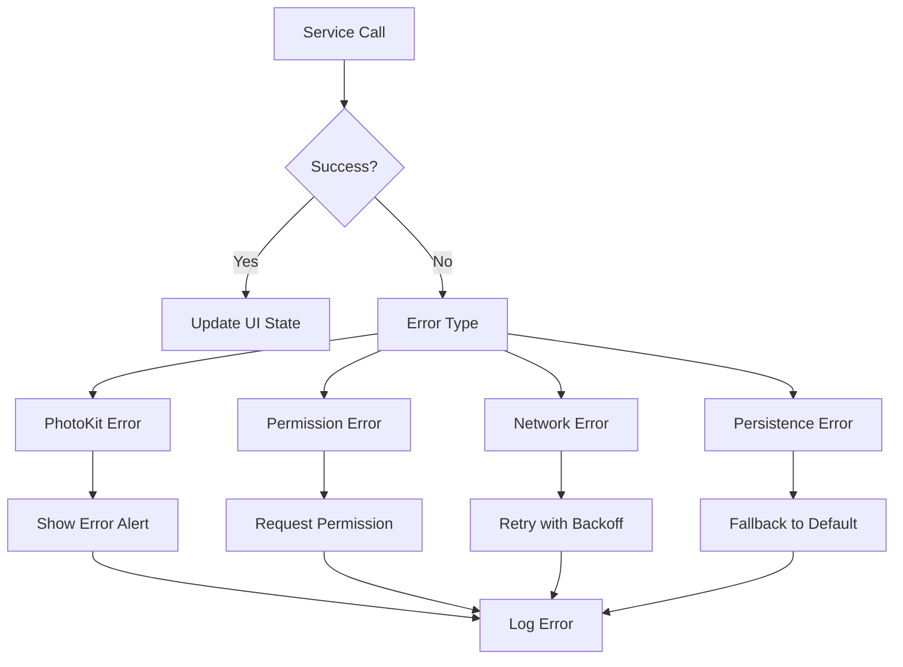

---

## 5. Observability

### 5.1 Current Observability Stack

| Component | Tool/Framework | Coverage |
|-----------|---------------|----------|
| **Crash Reporting** | iOS System Logs | Basic |
| **Performance Monitoring** | Xcode Instruments | Development only |
| **Error Logging** | print() statements | Limited |
| **User Analytics** | None | Missing |
| **Memory Monitoring** | Built-in MemoryWarning | Basic |

### 5.2 Recommended Observability Points

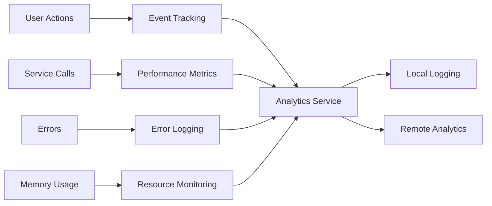

---

## 6. Tech Debt & Risks

### 6.1 Current Technical Debt

| Category | Issue | Impact | Effort |
|----------|-------|--------|--------|
| **Code Duplication** | Duplicate files in repo root | Medium | Low |
| **Architecture Inconsistency** | MonthListView missing ViewModel | Medium | Medium |
| **Unused Code** | Orphaned SecurityService | Low | Low |
| **Memory Management** | Potential photo loading issues | High | Medium |

### 6.2 Risk Assessment

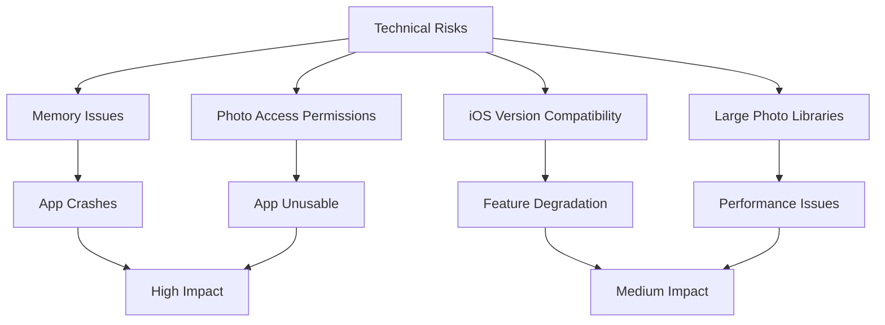

### 6.3 Mitigation Strategies

1. **Memory Management**
   - Implement progressive image loading
   - Add memory pressure monitoring
   - Optimize image caching strategy

2. **Permission Handling**
   - Graceful permission request flow
   - Clear user guidance for permission denial
   - Fallback functionality where possible

3. **Performance**
   - Lazy loading for large libraries
   - Background processing for heavy operations
   - Progress indicators for long operations

---

## 7. Refactor Plan

### 7.1 Phase 1: Technical Debt Cleanup (1-2 days)

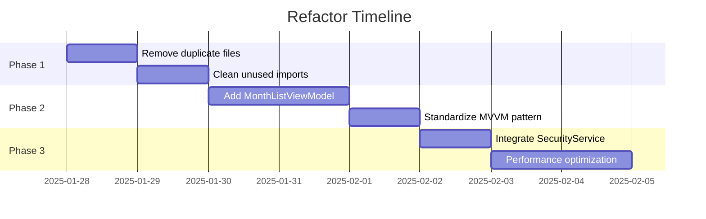

#### Tasks:
1. **Remove Duplicate Files** (Priority: High)
   - Delete `/Users/tkuo/Desktop/Pictro/Views/` directory
   - Ensure all references point to `/Users/tkuo/Desktop/Pictro/Pictro/Views/`
   - Verify build success

2. **Clean Unused Code** (Priority: Medium)
   - Integrate or remove `SecurityService`
   - Remove unused imports and methods
   - Update documentation

### 7.2 Phase 2: Architecture Consistency (2-3 days)

#### Tasks:
1. **Implement MonthListViewModel** (Priority: Medium)
   - Create dedicated ViewModel for MonthListView
   - Move business logic from View to ViewModel
   - Implement proper state management

2. **Standardize Error Handling** (Priority: Medium)
   - Consistent error types across services
   - Centralized error presentation
   - User-friendly error messages

### 7.3 Phase 3: Performance & UX Enhancements (1-2 days)

#### Tasks:
1. **Memory Optimization** (Priority: High)
   - Enhanced image memory management
   - Progressive loading for large libraries
   - Memory warning handling

2. **User Experience** (Priority: Medium)
   - Smooth animations and transitions
   - Loading states and progress indicators
   - Haptic feedback refinement

### 7.4 Success Metrics

| Metric | Current | Target | Measurement |
|--------|---------|--------|-------------|
| **Build Time** | ~30s | <25s | Xcode build logs |
| **Memory Usage** | Variable | <150MB peak | Instruments |
| **Code Coverage** | Unknown | >80% | XCTest |
| **Technical Debt** | Medium | Low | SonarQube/Manual |

---

## 8. Appendix

### 8.1 File Structure Overview

```
Pictro/
├── Pictro/
│   ├── Views/
│   │   ├── MonthListView.swift ✓
│   │   ├── SwipeReviewView.swift ✓
│   │   ├── FullscreenCardView.swift ✓
│   │   └── ReviewDeckView.swift (unused)
│   ├── Services/
│   │   ├── PhotoLibraryService.swift ✓
│   │   ├── PersistenceService.swift ✓
│   │   ├── HapticsService.swift ✓
│   │   ├── SecurityService.swift (underutilized)
│   │   └── BiometricAuthService.swift ✓
│   └── ViewModels/
│       ├── ReviewViewModel.swift ✓
│       └── MonthListViewModel.swift ✓
├── Views/ (DUPLICATE - TO REMOVE)
│   ├── FullscreenCardView.swift ❌
│   ├── ReviewDeckView.swift ❌
│   └── SwipeReviewView.swift ❌
└── docs/ (NEW)
    ├── EDD.md
    ├── unused_code_report.md
    └── refactor_plan.md
```

### 8.2 Key Metrics Summary

- **Total Swift Files**: 14
- **Duplicate Files**: 3 (to be removed)
- **Service Classes**: 5
- **View Components**: 4 (active)
- **ViewModels**: 2
- **Architecture Score**: A- (Excellent with minor improvements needed)

### 8.3 Next Steps

1. **Immediate** (This Sprint)
   - Execute Phase 1 refactor tasks
   - Remove duplicate files
   - Verify build integrity

2. **Short-term** (Next Sprint)
   - Implement missing ViewModels
   - Standardize architecture patterns
   - Add comprehensive testing

3. **Medium-term** (Next Month)
   - Performance monitoring implementation
   - User analytics integration
   - Advanced error handling

---

**Document Status**: ✅ Complete
**Last Updated**: 2025-01-28
**Next Review**: 2025-02-28