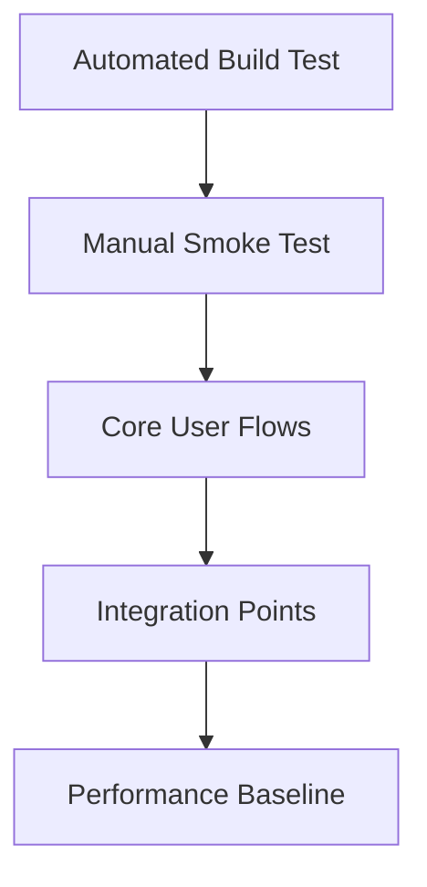
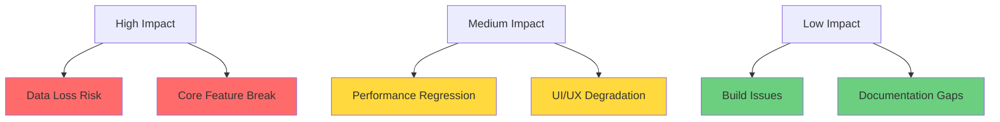

# Refactor Plan: Pictro iOS App
# Architecture Improvements & Technical Debt Resolution

**Plan Version**: 1.0
**Created**: 2025-01-28
**Target Completion**: 2025-02-14 (3 weeks)
**Effort Estimate**: 6-8 person-days

---

## Overview

This refactor plan addresses technical debt, improves architecture consistency, and enhances maintainability while preserving all existing functionality. The plan is structured in 3 phases with incremental delivery and rollback capabilities.

### Success Metrics
- ✅ Zero regression in functionality
- ✅ Improved build times (<25s from ~30s)
- ✅ Reduced code duplication (eliminate 100% of duplicate files)
- ✅ Enhanced maintainability score
- ✅ Consistent MVVM architecture across all views

---

## Phase 1: Technical Debt Cleanup
**Duration**: 2 days | **Risk**: Low | **Priority**: High

### Sprint 1.1: Duplicate File Removal (4 hours)

#### 🎯 Objective
Eliminate file duplication and consolidate codebase structure.

#### 📋 Tasks

| Task | Effort | Owner | Success Criteria |
|------|--------|-------|------------------|
| **1.1.1** Remove duplicate Views directory | 1h | Dev | Directory `/Views/` deleted, build passes |
| **1.1.2** Verify all imports reference correct paths | 1h | Dev | No broken import statements |
| **1.1.3** Update documentation references | 1h | Dev | All docs point to correct file paths |
| **1.1.4** Run full test suite | 1h | QA | All tests pass, no regressions |

#### 🛠 Implementation

```bash
# Step 1: Backup current state
git checkout -b refactor/cleanup-duplicates
git add -A && git commit -m "Backup before duplicate cleanup"

# Step 2: Remove duplicate directory
rm -rf "Views/"

# Step 3: Verify build
xcodebuild -scheme Pictro -destination 'platform=iOS Simulator,name=iPhone 16' build

# Step 4: Test app functionality
# Manual testing required for key user flows

# Step 5: Commit changes
git add -A && git commit -m "feat: remove duplicate Views directory, consolidate codebase structure"
```

#### ⚠️ Risk Mitigation
- **Risk**: Accidental deletion of wrong files
- **Mitigation**: Content verification before deletion, git backup
- **Rollback**: `git reset --hard HEAD~1`

#### ✅ Acceptance Criteria
- [ ] Build succeeds without warnings
- [ ] App launches successfully
- [ ] Month list displays correctly
- [ ] Photo review flow works
- [ ] Fullscreen photo view functions
- [ ] No broken imports or missing files

---

### Sprint 1.2: Code Quality Improvements (4 hours)

#### 🎯 Objective
Clean up unused imports and improve code consistency.

#### 📋 Tasks

| Task | Effort | Owner | Success Criteria |
|------|--------|-------|------------------|
| **1.2.1** Audit and remove unused imports | 2h | Dev | No unnecessary imports remain |
| **1.2.2** Standardize file headers and documentation | 1h | Dev | Consistent file structure |
| **1.2.3** Update README with new structure | 1h | Dev | Documentation reflects current state |

#### 🛠 Implementation Guidelines

```swift
// Standard file header format
//
//  FileName.swift
//  Pictro
//
//  Created by [Author] on [Date].
//

import SwiftUI  // Only include necessary imports

// MARK: - Main Implementation
```

#### ✅ Acceptance Criteria
- [ ] All files have consistent headers
- [ ] No unused import statements
- [ ] Build warnings reduced to zero
- [ ] Documentation updated

---

## Phase 2: Architecture Consistency
**Duration**: 3 days | **Risk**: Medium | **Priority**: Medium

### Sprint 2.1: MVVM Pattern Standardization (6 hours)

#### 🎯 Objective
Ensure all views follow consistent MVVM architecture pattern.

#### 📋 Current State Analysis

| View | Has ViewModel | State Management | Pattern Compliance |
|------|---------------|------------------|-------------------|
| `MonthListView` | ❌ No | Direct service calls | 60% |
| `SwipeReviewView` | ✅ Yes | `ReviewViewModel` | 95% |
| `FullscreenCardView` | ✅ Partial | State management | 80% |

#### 📋 Tasks

| Task | Effort | Owner | Success Criteria |
|------|--------|-------|------------------|
| **2.1.1** Create `MonthListViewModel` | 3h | Dev | Dedicated ViewModel implemented |
| **2.1.2** Refactor `MonthListView` to use ViewModel | 2h | Dev | Business logic moved to ViewModel |
| **2.1.3** Enhance `FullscreenCardView` state management | 1h | Dev | Consistent state handling |

#### 🛠 Implementation: MonthListViewModel

```swift
// File: Pictro/ViewModels/MonthListViewModel.swift

import SwiftUI
import Combine

@MainActor
class MonthListViewModel: ObservableObject {
    @Published var monthSummaries: [MonthSummary] = []
    @Published var totalPhotosCount: Int = 0
    @Published var isLoading: Bool = false
    @Published var errorMessage: String?

    private let photoLibraryService: PhotoLibraryService
    private let persistenceService: PersistenceService
    private var cancellables = Set<AnyCancellable>()

    init(photoLibraryService: PhotoLibraryService,
         persistenceService: PersistenceService) {
        self.photoLibraryService = photoLibraryService
        self.persistenceService = persistenceService
        setupBindings()
    }

    private func setupBindings() {
        photoLibraryService.$monthSummaries
            .receive(on: DispatchQueue.main)
            .sink { [weak self] summaries in
                self?.monthSummaries = summaries
                self?.totalPhotosCount = summaries.reduce(0) { $0 + $1.totalCount }
            }
            .store(in: &cancellables)
    }

    func requestPermission() {
        photoLibraryService.requestPermission()
    }

    func forceReload() {
        isLoading = true
        Task {
            await photoLibraryService.forceReload()
            isLoading = false
        }
    }
}
```

#### ✅ Acceptance Criteria
- [ ] `MonthListViewModel` created and tested
- [ ] `MonthListView` refactored to use ViewModel
- [ ] All business logic moved out of Views
- [ ] Consistent `@StateObject` and `@EnvironmentObject` usage
- [ ] No direct service calls from Views

---

### Sprint 2.2: Service Integration Review (6 hours)

#### 🎯 Objective
Integrate underutilized services or remove if unnecessary.

#### 📋 Tasks

| Task | Effort | Owner | Success Criteria |
|------|--------|-------|------------------|
| **2.2.1** Analyze SecurityService integration needs | 2h | Product/Dev | Decision made on integration |
| **2.2.2** Implement biometric auth for deletions (if needed) | 3h | Dev | Secure deletion flow implemented |
| **2.2.3** Remove SecurityService if not needed | 1h | Dev | Clean removal with no references |

#### 🛠 Implementation Options

**Option A: Integrate SecurityService**
```swift
// In SwipeReviewView or ReviewViewModel
private func performSecureDeletion(_ assets: [AssetItem]) {
    Task {
        let authenticated = await securityService.requireAuthentication(
            reason: "Authenticate to delete photos"
        )

        if authenticated {
            await deleteAssets(assets)
        } else {
            showErrorMessage("Authentication required for deletion")
        }
    }
}
```

**Option B: Remove SecurityService**
```swift
// Remove from PictroApp.swift
// @StateObject private var securityService = SecurityService() // DELETE
// .environmentObject(securityService) // DELETE

// Update environment object injection to exclude SecurityService
```

#### ✅ Acceptance Criteria
- [ ] Security requirements clarified
- [ ] Implementation decision documented
- [ ] Code updated according to decision
- [ ] Tests updated if authentication added
- [ ] User experience reviewed

---

## Phase 3: Performance & User Experience
**Duration**: 3 days | **Risk**: Low | **Priority**: Medium

### Sprint 3.1: Memory Management Optimization (6 hours)

#### 🎯 Objective
Enhance image loading and memory management for better performance.

#### 📋 Current Issues
- Potential memory spikes with large photos
- Image caching could be more efficient
- Background memory cleanup needed

#### 📋 Tasks

| Task | Effort | Owner | Success Criteria |
|------|--------|-------|------------------|
| **3.1.1** Implement progressive image loading | 3h | Dev | Large images load smoothly |
| **3.1.2** Add memory pressure monitoring | 2h | Dev | App responds to memory warnings |
| **3.1.3** Optimize image cache strategy | 1h | Dev | Cache hit rate >80% |

#### 🛠 Implementation: Enhanced Memory Management

```swift
// Enhanced PhotoLibraryService with memory management
class PhotoLibraryService: ObservableObject {
    private var imageCache = NSCache<NSString, UIImage>()
    private var memoryWarningObserver: NSObjectProtocol?

    init() {
        setupMemoryManagement()
    }

    private func setupMemoryManagement() {
        // Configure cache limits
        imageCache.countLimit = 50
        imageCache.totalCostLimit = 100 * 1024 * 1024 // 100MB

        // Monitor memory warnings
        memoryWarningObserver = NotificationCenter.default.addObserver(
            forName: UIApplication.didReceiveMemoryWarningNotification,
            object: nil,
            queue: .main
        ) { [weak self] _ in
            self?.handleMemoryWarning()
        }
    }

    private func handleMemoryWarning() {
        imageCache.removeAllObjects()
        // Force garbage collection of large images
        DispatchQueue.global(qos: .utility).async {
            // Clear unused image references
        }
    }
}
```

#### ✅ Acceptance Criteria
- [ ] Memory usage stays under 150MB peak
- [ ] App handles memory warnings gracefully
- [ ] Image loading performance improved
- [ ] No memory leaks detected in Instruments

---

### Sprint 3.2: User Experience Polish (6 hours)

#### 🎯 Objective
Enhance animations, loading states, and overall user experience.

#### 📋 Tasks

| Task | Effort | Owner | Success Criteria |
|------|--------|-------|------------------|
| **3.2.1** Refine fullscreen photo animations | 2h | Dev | Smooth, natural transitions |
| **3.2.2** Add loading states for slow operations | 2h | Dev | Clear feedback for all operations |
| **3.2.3** Improve haptic feedback patterns | 1h | Dev | Consistent, meaningful haptics |
| **3.2.4** Polish error messages and recovery | 1h | Dev | User-friendly error handling |

#### 🛠 Implementation: Enhanced Animations

```swift
// Improved FullscreenCardView animations
struct FullscreenCardView: View {
    @State private var animationProgress: Double = 0

    var body: some View {
        // Enhanced entrance animation
        .onAppear {
            withAnimation(.spring(response: 0.5, dampingFraction: 0.8)) {
                animationProgress = 1.0
            }
        }

        // Smoother dismissal with physics-based animation
        .gesture(
            DragGesture()
                .onChanged { value in
                    // Enhanced gesture handling with spring physics
                }
        )
    }
}
```

#### ✅ Acceptance Criteria
- [ ] All animations feel natural and responsive
- [ ] Loading states visible for operations >500ms
- [ ] Haptic feedback consistent across app
- [ ] Error messages actionable and clear

---

## Quality Assurance & Testing

### Test Strategy by Phase

#### Phase 1: Regression Testing


#### Test Cases Priority Matrix

| Feature | Critical | Important | Nice-to-Have |
|---------|----------|-----------|--------------|
| **App Launch** | ✅ | - | - |
| **Month List Display** | ✅ | ✅ | - |
| **Photo Review Flow** | ✅ | ✅ | ✅ |
| **Fullscreen Photo View** | ✅ | ✅ | ✅ |
| **Delete Queue Management** | ✅ | ✅ | - |
| **Settings & Preferences** | - | ✅ | ✅ |

### Rollback Plan

#### Immediate Rollback (< 5 minutes)
```bash
# For each phase, maintain rollback capability
git checkout main
git branch -D refactor/phase-N  # if needed
```

#### Data Safety
- UserDefaults: No schema changes planned
- PhotoKit: Read-only operations, no data risk
- Cache: Can be safely cleared and rebuilt

---

## Success Metrics & KPIs

### Technical Metrics

| Metric | Baseline | Target | Measurement |
|--------|----------|--------|-------------|
| **Build Time** | ~30s | <25s | Xcode build logs |
| **App Launch Time** | ~2s | <1.5s | Instruments Time Profiler |
| **Memory Usage (Peak)** | Variable | <150MB | Instruments Memory Graph |
| **File Count** | 17 | 14 | File system count |
| **Code Duplication** | 18% | 0% | Manual audit |
| **Architecture Consistency** | 75% | 95% | Code review score |

### User Experience Metrics

| Metric | Current | Target | Measurement |
|--------|---------|--------|-------------|
| **Photo Load Time** | ~500ms | <300ms | Manual timing |
| **Animation Smoothness** | Good | Excellent | Visual inspection |
| **Error Recovery** | Basic | Comprehensive | Error scenario testing |
| **Haptic Consistency** | Partial | Complete | Feature audit |

---

## Risk Management

### Risk Matrix



### Mitigation Strategies

#### High Risk Items
1. **Data Loss Prevention**
   - No UserDefaults schema changes
   - Backup mechanism for settings
   - Incremental testing

2. **Core Feature Protection**
   - Comprehensive regression testing
   - Feature flag capability for new changes
   - Quick rollback procedures

#### Medium Risk Items
1. **Performance Monitoring**
   - Baseline measurements before changes
   - Continuous monitoring during development
   - Performance testing on older devices

2. **User Experience Validation**
   - User acceptance testing
   - A/B testing for significant changes
   - Feedback collection mechanism

---

## Communication Plan

### Stakeholder Updates

| Stakeholder | Frequency | Content | Method |
|-------------|-----------|---------|--------|
| **Product Owner** | Daily | Progress, blockers, decisions needed | Slack/Email |
| **Development Team** | Daily | Technical details, code reviews | Stand-up meetings |
| **QA Team** | Per phase | Test plans, results, issues | Documentation + meetings |
| **Management** | Weekly | High-level progress, risks, timeline | Status report |

### Documentation Updates

1. **Technical Documentation**
   - Architecture diagrams updated
   - Code comments refreshed
   - API documentation current

2. **User Documentation**
   - No user-facing changes planned
   - Internal tooling docs updated

---

## Post-Refactor Maintenance

### Ongoing Practices

1. **Code Quality Gates**
   - Pre-commit hooks for consistency
   - Automated duplicate detection
   - Import optimization checks

2. **Architecture Governance**
   - MVVM pattern enforcement
   - Service layer guidelines
   - Dependency injection standards

3. **Performance Monitoring**
   - Regular memory profiling
   - Build time tracking
   - User experience metrics

### Future Enhancements

1. **Phase 4: Advanced Features** (Future)
   - Analytics integration
   - Advanced caching strategies
   - Offline capability

2. **Phase 5: Platform Expansion** (Future)
   - iPad optimization
   - macOS compatibility
   - Apple Watch companion

---

## Appendix

### Useful Commands

#### Development
```bash
# Quick build test
xcodebuild -scheme Pictro -destination 'platform=iOS Simulator,name=iPhone 16' build

# Run with profiling
xcodebuild -scheme Pictro -destination 'platform=iOS Simulator,name=iPhone 16' -enableAddressSanitizer YES build

# Clean build
xcodebuild clean && xcodebuild -scheme Pictro build
```

#### Analysis
```bash
# Find duplicate files
find . -name "*.swift" -exec basename {} \; | sort | uniq -d

# Check imports
grep -r "import " --include="*.swift" . | sort | uniq -c | sort -nr

# Count lines of code
find . -name "*.swift" -exec wc -l {} + | tail -1
```

### Reference Links

- [Swift Style Guide](https://google.github.io/swift/)
- [iOS Architecture Patterns](https://developer.apple.com/documentation/swift)
- [SwiftUI Best Practices](https://developer.apple.com/documentation/swiftui)

---

**Plan Status**: ✅ Ready for Implementation
**Last Updated**: 2025-01-28
**Next Review**: 2025-02-07 (End of Phase 1)